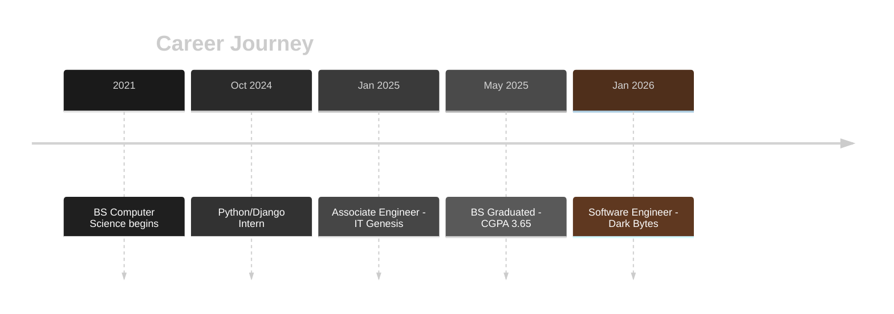
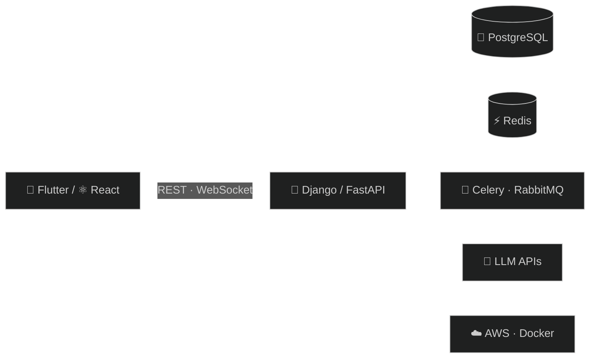

<!-- ================= HEADER ================= -->

  

  

  

  
  
  
  

  
  
  
  

<!-- ================= ABOUT ================= -->
<h2>💼 About Me</h2>

<table align="center">
<tr>
<td width="50%" valign="top">

🐍 **Backend** — Python · Django · FastAPI 
⚛️ **Frontend** — React · Redux Toolkit 
📱 **Mobile** — Flutter · Dart 
🤖 **AI** — LLM APIs · Vision pipelines

</td>
<td width="50%" valign="top">

⚡ **Real-time** — WebSockets · Channels 
💳 **Payments** — Gateway integrations 
☁️ **Cloud** — AWS · Docker · CI/CD 
🌱 **Focus** — Clean, maintainable code

</td>
</tr>
</table>

<!-- ================= EXPERIENCE ================= -->
<h2>🧭 Experience</h2>

<table align="center">
<tr>
<td width="33%" valign="top" align="center">

**🏢 Software Engineer** 
**Dark Bytes** 
`Jan 2026 – Present`  

</td>
<td width="33%" valign="top" align="center">

**🏢 Associate Software Engineer** 
**IT Genesis** 
`Jan 2025 – Dec 2025`  

</td>
<td width="33%" valign="top" align="center">

**🎓 Python/Django Intern** 
**Developers Hub Corp.** 
`Oct 2024 – Dec 2024`  

</td>
</tr>
</table>

<!-- ================= TECH STACK ================= -->
<h2>🛠️ Tech Stack</h2>

<h4>Languages &amp; Frontend</h4>

  

<h4>Backend, Databases &amp; Messaging</h4>

  

<h4>Cloud &amp; DevOps</h4>

  

<h4>Tools &amp; Design</h4>

  

  
  
  
  
  
  
  

  
  
  
  
  

<h4>🤖 AI Tooling</h4>

  
  
  
  
  

<!-- ================= SKILL CHARTS ================= -->
<h2>📈 Skill Insights</h2>

<table align="center">
<tr>
<td align="center" width="33%"><b>Skill Radar</b> </td>
<td align="center" width="33%"><b>Proficiency</b> </td>
<td align="center" width="33%"><b>Work Focus</b> </td>
</tr>
</table>

<h4>System Flow I Build</h4>

<!-- ================= PROJECTS ================= -->
<h2>🚀 Featured Projects</h2>

<table align="center">
<tr>
<td width="33%" valign="top" align="center">

### 🪙 CoinSnap
 
AI coin identification from photos using a vision-LLM pipeline.

</td>
<td width="33%" valign="top" align="center">

### 🩺 AI Health Assistant
 
LLM-powered health guidance with prompt orchestration.

</td>
<td width="33%" valign="top" align="center">

### 📈 Trading Platform
 
Real-time market data, trades &amp; portfolio tracking with JWT.

</td>
</tr>
<tr>
<td width="33%" valign="top" align="center">

### 🏢 Enterprise CRM
 
Sales pipelines, tickets &amp; role-based access control.

</td>
<td width="33%" valign="top" align="center">

### 🛒 Bonope POS
 
Cloud POS — inventory, barcode scanning &amp; offline sync.

</td>
<td width="33%" valign="top" align="center">

### 💬 Live Chat System
 
1:1 &amp; group chat with presence, typing &amp; push alerts.

</td>
</tr>
</table>

<!-- ================= GITHUB ANALYTICS ================= -->
<h2>📊 GitHub Analytics</h2>

  
  

  

  

  
  
  

  

  

<!-- Contribution snake (needs the workflow in .github/workflows/snake.yml in repo Axfal/Axfal) -->

  

<!-- ================= EDUCATION ================= -->
<h2>🎓 Education</h2>

  
  
  
  

<!-- ================= CONNECT ================= -->
<h2>📬 Let's Connect</h2>

  
  
  

  

  

